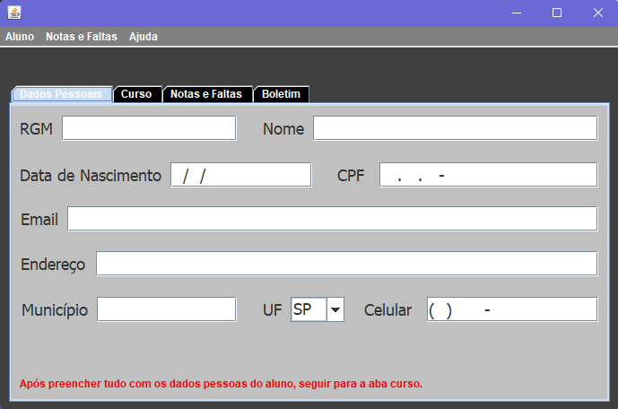
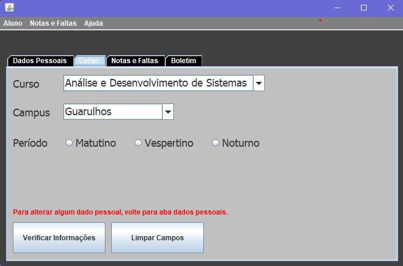
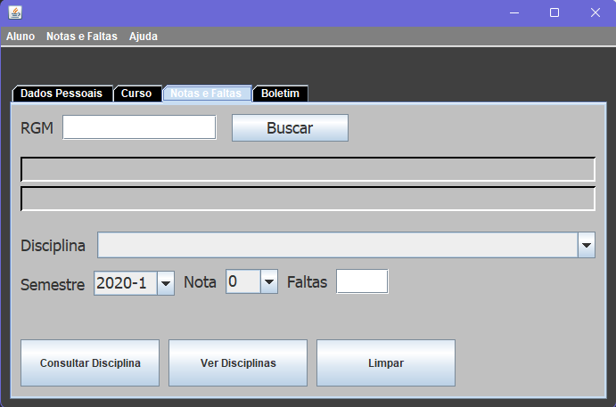
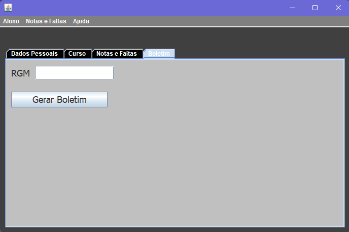
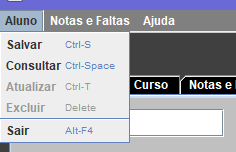
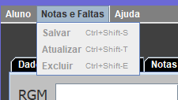
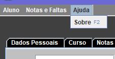

# Resumo do Projeto MVC – Sistema de Gestão Acadêmica

Este projeto consiste em um sistema desktop acadêmico desenvolvido com base na arquitetura MVC (Model-View-Controller), utilizando a linguagem Java com interface gráfica (Swing) e banco de dados MySQL. 

O sistema tem como objetivo gerenciar o cadastro de alunos, seus cursos, desempenho escolar (notas e faltas), e gerar consultas organizadas dessas informações, respeitando uma divisão clara entre modelo de dados, regras de negócio e interface com o usuário.

##  Funcionalidades principais:

 - Cadastro, consulta, alteração e exclusão de alunos.

 - Associação de alunos a cursos com informações de campus e período.

 - Registro de notas e faltas por disciplina e semestre.

 - Consulta e geração de boletins.

 - Validações e controle de duplicidade para evitar dados inconsistentes.

 - Navegação intuitiva por meio de menus separados: ```Aluno```, ```Notas e Faltas```, e ```Ajuda```.

## Arquitetura MVC aplicada:

 - **Model (Modelo)**: Classes ```Aluno```, ```Curso```, ```Disciplina``` e ```Desempenho``` representam as entidades do banco.

 - **View (Visão)**: Telas gráficas (GUI com Swing), organizadas em abas e menus para melhor experiência do usuário.

 - **Controller (Controle)**: Classes DAO (```AlunoDAO```, ```DesempenhoDAO``` etc.) centralizam a lógica de persistência e comunicação com o banco.

## Gerenciamento de Conexão:

O projeto utiliza uma classe utilitária chamada ```ConnectionFactory```, responsável por:

 - Estabelecer a conexão com o banco de dados MySQL;

 - Facilitar o reaproveitamento de código;

 - Encapsular os detalhes de configuração (URL, usuário, senha);

 - Fechar conexões e recursos após o uso, garantindo segurança e eficiência.

Essa separação reforça a organização do projeto e permite escalabilidade e manutenção mais fáceis.

---

## Como executar

### Pré-requisitos
- Java 17
- Eclipse ou qualquer IDE Java

### Passos
1. Clone o repositório:
```bash
https://github.com/NicoleTrujillano/Projeto-MVC.git
```
2. Abra o projeto na sua IDE (Eclipse recomendado)
3. Compile e execute a classe `Tela.java`

---

## Capturas de Tela

| Abas e Menus                            | Capturas de Tela       |
|--------------------------------------------|------------|
| **Dados Pessoais**                    |   |
| **Curso**                    |     |
| **Notas e Faltas**                    |     |
| **Boletim**                    |     |
| **Menu Aluno**                    |     |
| **Menu Notas e Faltas**                    |     |
| **Menu Ajuda**                    |     |

